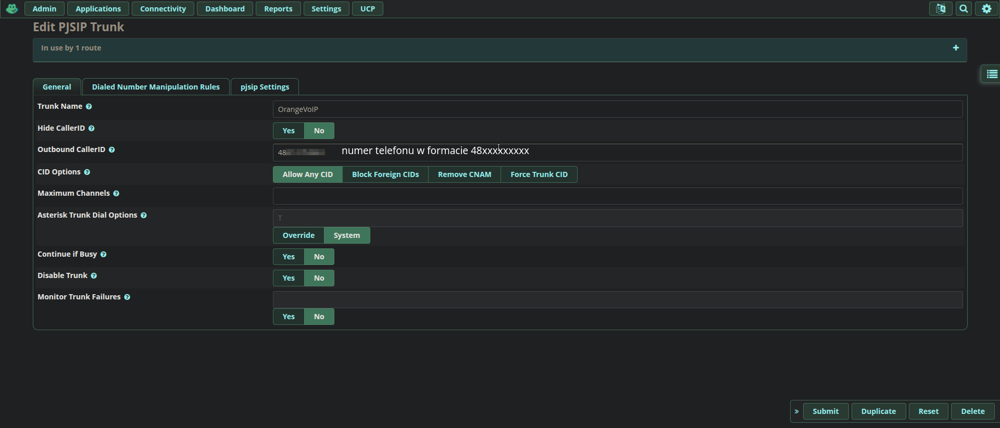
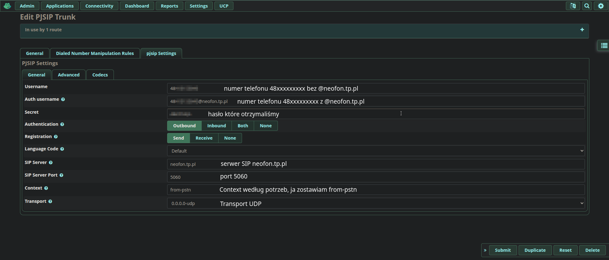
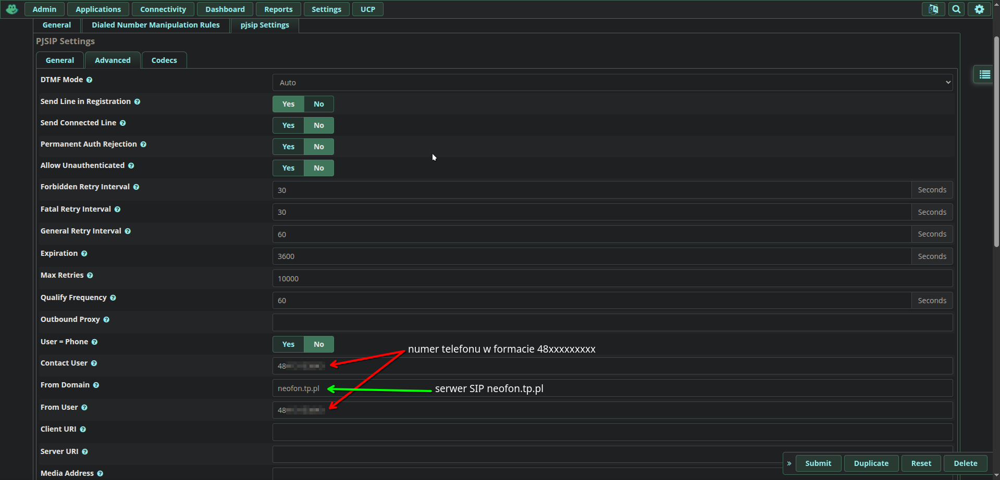
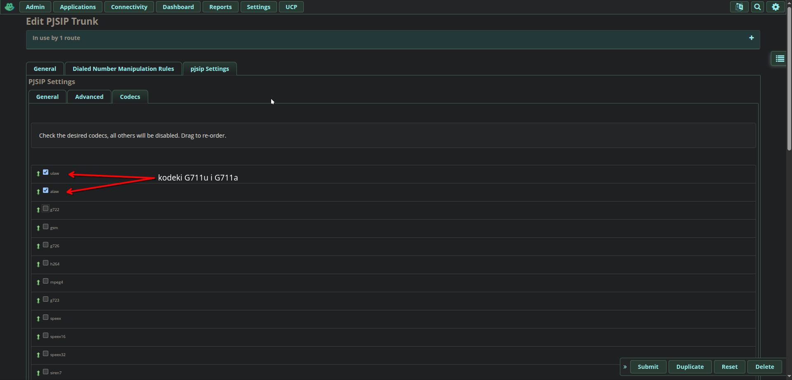
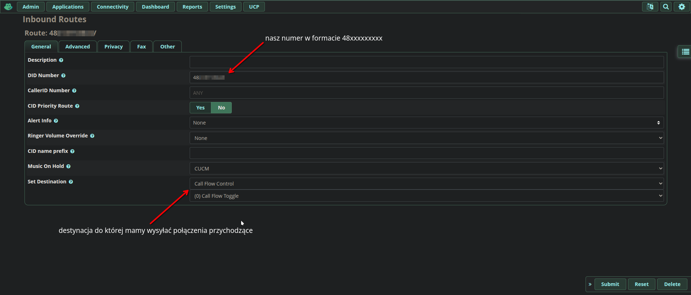
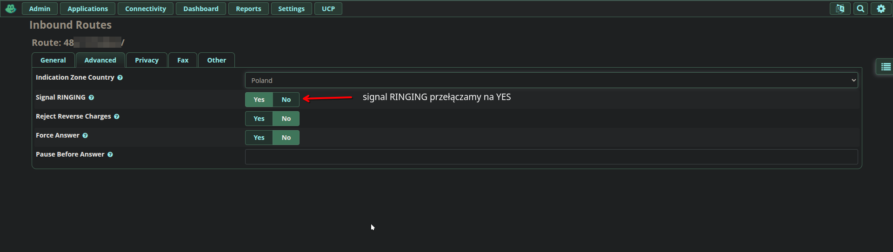
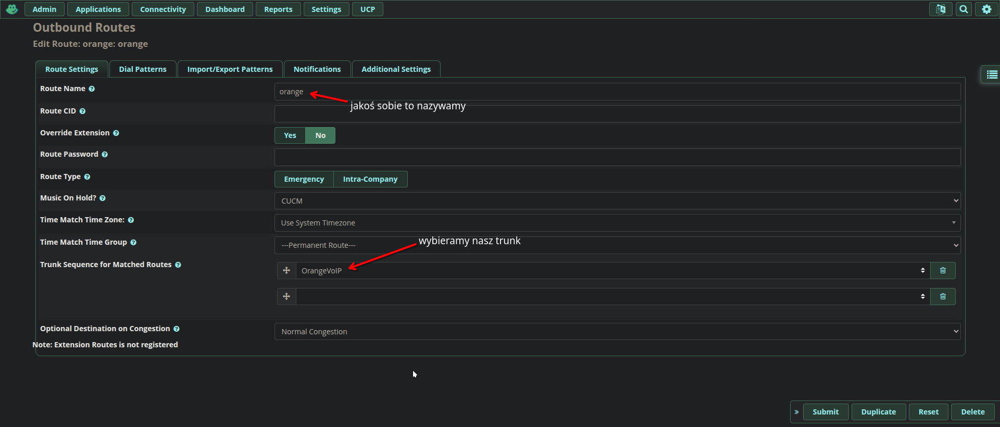
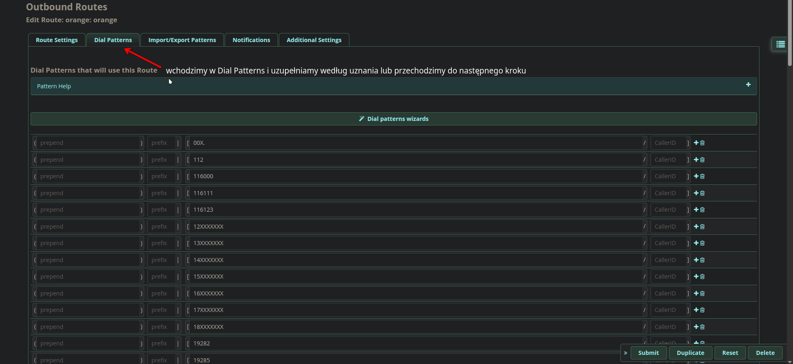
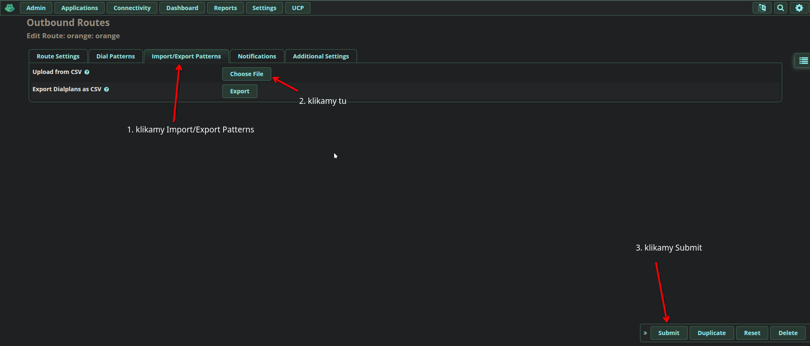
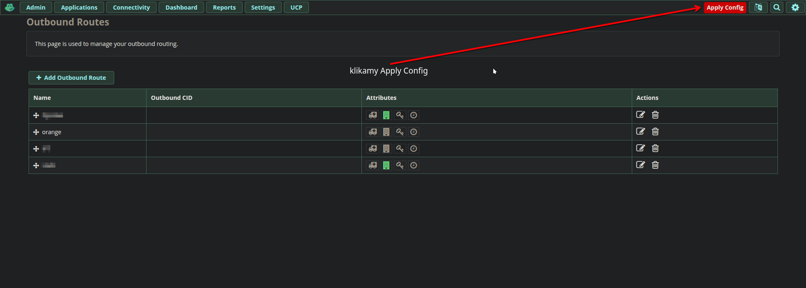

# [Instructions in English 🇬🇧/🇺🇸](README_en.md) <--- Click here
# Jak dodać telefon domowy Orange do FreePBX jako trunk

Wraz z światłowodem często dostajemy telefon domowy w ramach pakietu Orange LOVE. Telefon ten jest oparty na technologii VoIP więc technicznie nie musi być dostępny tylko na FunBoxie.

---

### 1. Otrzymanie danych VoIP
Aby cokolwiek zrobić z tym telefonem musimy mieć do niego dane logowania. Dane możemy uzyskać na infolinii, należy poprosić o dane logowania do neofonu.

Dane otrzymamy mailem lub SMSem, będą one miały format `48xxxxxxxxx@neofon.tp.pl`, gdzie `xxxxxxxxx` to nasz numer telefonu, oraz hasło które oczywiście dla każdego jest inne.

---

### 2. Dodanie trunka w FreePBX
Wchodzimy w `Connectivity` ---> `Trunks` i uzupełniamy jak na obrazkach

---

### 3. Inbound route dla trunka

Wchodzimy w `Connectivity` ---> `Inbound Routes` i uzupełniamy jak na obrazkach

---

### 4. Outbound route dla trunka

Wchodzimy w `Connectivity` ---> `Outbound Routes` i uzupełniamy jak na obrazkach

Przygotowałem dial patterns dla (chyba) wszystkich numerów publicznych w Polsce, które możemy importować. [Pobierz](files/dial_pattern.csv)

---

### Kontakt
Jeśli macie jakieś pytania proszę kierować je na adres mailowy: [kubab945@gmail.com](mailto:kubab945@gmail.com).

Lub otworzyć [GitHub issue](https://github.com/buba0/Orange-VoIP-FreePBX-Trunk/issues).

&copy; 2026 [buba.net.pl](https://buba.net.pl)

## Star History

<a href="https://www.star-history.com/#buba0/Orange-VoIP-FreePBX-Trunk&type=date&legend=top-left">
 <picture>
   <source media="(prefers-color-scheme: dark)" srcset="https://api.star-history.com/svg?repos=buba0/Orange-VoIP-FreePBX-Trunk&type=date&theme=dark&legend=top-left" />
   <source media="(prefers-color-scheme: light)" srcset="https://api.star-history.com/svg?repos=buba0/Orange-VoIP-FreePBX-Trunk&type=date&legend=top-left" />
   
 </picture>
</a>
